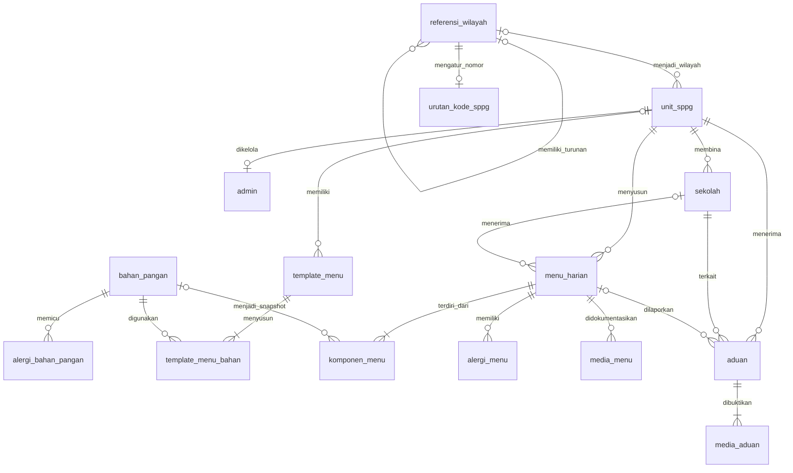

# Relasi Database Nuara

## Logika Relasi

| Relasi | Kegunaan |
|---|---|
| `unit_sppg` ke `admin` | Unique constraint membatasi satu akun per unit. Backend memastikan `admin_sppg` memiliki unit dan Super Admin tidak terikat pada unit. |
| `unit_sppg` ke `sekolah` | Menentukan unit yang memasok makanan ke setiap sekolah. |
| `unit_sppg` ke `menu_harian` | Memastikan riwayat menu selalu diketahui berasal dari dapur mana. |
| `sekolah` ke `menu_harian` | Nilai kosong berarti menu berlaku untuk semua sekolah aktif pada unit tersebut. |
| `bahan_pangan` ke `alergi_bahan_pangan` | Menentukan kategori alergi langsung dari bahan, bukan dari tebakan admin. |
| `template_menu` ke `template_menu_bahan` | Menyimpan susunan bahan dan berat saji yang dapat dipakai kembali. Template bawaan memiliki `id_unit_sppg` kosong, sedangkan template buatan admin hanya dimiliki unitnya. |
| `bahan_pangan` ke `template_menu_bahan` | Menjadi sumber nilai nutrisi per 100 gram yang dihitung sesuai berat saji. |
| `menu_harian` ke `komponen_menu` | Menyimpan snapshot bahan, berat, nama, dan porsi saat menu diterbitkan agar riwayat tidak berubah ketika katalog diperbarui. Komponen manual lama tetap didukung. |
| `menu_harian` ke `alergi_menu` | Satu menu dapat memiliki beberapa kategori alergi tanpa menyimpan daftar dalam satu teks. |
| `menu_harian` ke `media_menu` | Satu menu dapat memiliki foto dan video dokumentasi. |
| `unit_sppg` dan `sekolah` ke `aduan` | Mengarahkan aduan anonim kepada admin unit yang benar tanpa menyimpan identitas orang tua atau anak. |
| `menu_harian` ke `aduan` | Menghubungkan laporan dengan menu tertentu bila orang tua memilih riwayat menu. |
| `aduan` ke `media_aduan` | Menyimpan satu atau lebih bukti foto/video secara terpisah dari isi laporan. |
| `referensi_wilayah` ke dirinya sendiri | Membentuk hierarki provinsi, kabupaten/kota, kecamatan, dan kelurahan/desa melalui `kode_induk`. |
| `referensi_wilayah` ke `unit_sppg` | Menjamin empat kode wilayah unit berasal dari master wilayah yang tersedia. |
| `referensi_wilayah` ke `urutan_kode_sppg` | Menjamin nomor urut kode SPPG hanya dibuat untuk kode kelurahan/desa yang tersedia. |

Foreign key gabungan memastikan sekolah dan menu pada aduan berada dalam unit SPPG yang sama. Dalam pemakaian harian, data sekolah dan menu cukup dinonaktifkan agar riwayat tetap tersedia.

Super Admin dapat menghapus permanen sebuah unit beserta akun admin, sekolah, menu, dokumentasi, aduan, dan bukti medianya. Backend menghapus relasi dalam urutan yang aman di dalam satu transaksi, lalu membersihkan file fisik setelah transaksi berhasil. Admin unit tidak memiliki hak akses ini.

Nilai pada `bahan_pangan` memakai basis 100 gram dan menyimpan kode TKPI serta tautan sumber. Saat menu otomatis disimpan, backend menghitung ulang kalori, protein, lemak, dan karbohidrat dari `berat_gram`; hasil kalkulasi pada browser tidak langsung dipercaya.

Katalog awal menyediakan 32 template: 3 template awal berbasis bahan TKPI, 9 variasi nasi/ubi/jagung, dan 20 variasi protein sapi, lele, salmon, serta nila. Bahan tambahan protein memakai Foundation Foods dari USDA FoodData Central. Label `Terverifikasi` hanya diberikan ketika seluruh bahan pada template telah ditandai terverifikasi di katalog. Label `Referensi` berarti kalkulasi otomatis tetap berjalan, tetapi susunan menu, berat saji, bumbu, ketersediaan bahan, dan metode memasaknya wajib diperiksa ahli gizi sebelum dipakai secara operasional.

Tabel `menu_harian` memakai `kunci_cakupan` internal untuk unique constraint: `0` berarti semua sekolah, sedangkan ID sekolah berarti menu khusus. Nilai ini selalu diisi backend bersama `id_sekolah` dan tidak perlu dikirim oleh Flutter.
